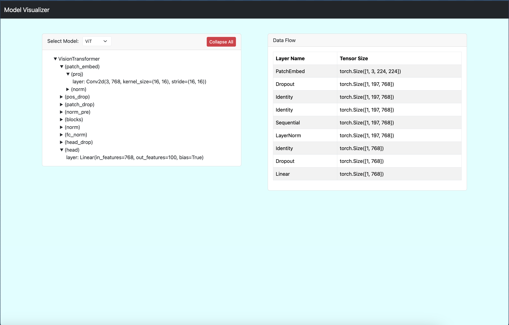

# Large Vision Models Complexity Analysis

This project focuses on **analyzing the computational and memory complexities** of various **Large Vision Models (LVMs)** while training and fine-tuning them on standard datasets like **CIFAR-100** and **ImageNet1K**. The analysis aims to measure and compare key metrics such as computational efficiency, memory usage, and inference latency across different models.

## Supported Models
The project supports the following models for training and fine-tuning:
- **Vision Transformer (ViT)**
- **Data-efficient Image Transformer (DeiT)**
- **Swin Transformer**
- **ResNet**

## Metrics Measured
The analysis covers the following metrics:

### 1. **Computational Efficiency**
- **Time Per Forward Pass (in milliseconds):** Vary input sizes and measure latency.
- **Training Time Per Epoch:** Measure the time taken per dataset epoch for equivalent tasks.
- **Floating Point Operations (FLOPs):** Compute the number of operations for a forward pass.

### 2. **Memory Efficiency**
- **GPU/CPU Memory Consumption:** Monitor peak memory usage during training and inference.
- **Memory Reserved vs. Memory Allocated (GPU-specific):** Detailed analysis of GPU memory usage.

### 3. **Inference Latency**
- **Per-instance Inference Latency:** Measure the time taken for each prediction during inference.

### 4. **Performance vs. Complexity**
- Compare task-specific performance (e.g., accuracy) against computational costs like FLOPs and latency.

<hr>

# Running the Analysis

## Setup and Prerequisites

1. Clone the repository:
```
git clone <repository_url>
cd <repository_directory>
```
2. Install dependencies
3. Download ImageNet-1K dataset and place in `./data` folder

## Run Analysis

```
python train.py --model <model_name> --batch_size <batch_size> --lr <learning_rate> --epochs <num_epochs> --phase <1|2> --device <cuda|cpu>|<mps>
```

```
Example:
python train.py --model vit --batch_size 128 --lr 0.001 --epochs 50 --phase 2 --device cuda
```

--model      - Choose the model: vit, deit, swin, or resnet.
--batch_size - Batch size for training and testing.
--lr         - Learning rate for the optimizer.
--epochs     - Number of epochs for training.
--output_dir - Directory where model checkpoints and logs will be saved.
--phase      - 1 for pretraining, 2 for fine-tuning.
--device     - Specify cuda for GPU or cpu for CPU.


<hr>

# Model Visualizer

The **Model Visualizer** is a Flask-based web application that allows you to visualize the architecture of large vision models (ViT, DeiT, Swin, ResNet) and inspect their layer sizes and parameters interactively.

## Running the Model Visualizer

To run the model visualizer, follow these steps:

1. **Start the Flask server:**
   Navigate to the directory where the `model_viz.py` file is located and run the following command:

```
python model_viz.py
```

2. The server will start, and you can access the model visualizer in your web browser at `http://127.0.0.1:5000/`.

## Visualizing a Model

- Once the Flask server is running, you can choose between supported models (ViT, DeiT, Swin, ResNet) and view their architectures layer by layer.
- The visualizer will display the model architecture along with detailed information about the input size after each layer.
- You can interact with the architecture, collapse/expand layers, and view the model's computation and memory requirements in real-time.

## Screenshot

Here is a screenshot of the Model Visualizer interface:



This image provides a preview of what you will see once the Flask server is running and you've loaded the model of your choice.

<hr>
